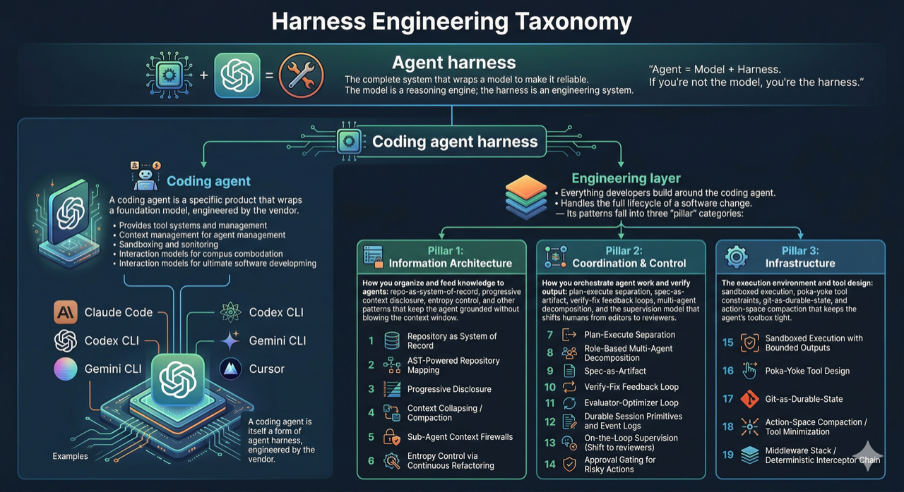

# Introduction

Agent Validator is a validation loop for AI-assisted development. It detects changed files, maps those files to configured entry points, runs the matching gates, and writes logs plus execution state so a coding agent can fix failures and rerun only the relevant validation.

Agent Validator runs *during* development, not after a PR is opened. The agent writes code, Agent Validator runs checks and cross-agent reviews, the agent reads failures and iterates - in a tight loop until everything passes. By the time you see the result, it's already been put through "the gauntlet".

## Core Concepts

Agent Validator has three main configuration concepts:

| Concept | Meaning |
| --- | --- |
| Entry point | A path in the repository that activates gates when matching files change |
| Check | A deterministic shell command such as build, lint, test, or static analysis |
| Review | An AI review prompt dispatched through a local CLI adapter |

Entry points decide when gates run. Checks and reviews decide what feedback the agent receives.

Agent Validator runs two kinds of feedback controls. Some are deterministic: linters, type checks, tests, security scanners. They are fast, computational, and boring in the best way. If the type checker says the code doesn't compile, there isn't much to debate.

The other kind is inferential. This is where code review agents fit. They are slower and messier because they use a model to make a judgment: did this change hide a bug, miss an error path, violate the spec, or create a risk that normal checks don't know how to express? Agent Validator runs both types locally.

## Validation Flow

1. The CLI loads `.validator/config.yml`.
2. Git change detection finds committed, uncommitted, and untracked changes.
3. Entry points expand against the changed paths.
4. The job generator creates check and review jobs for the matching entry points.
5. Checks run shell commands; reviews run configured prompts through supported adapters.
6. Logs, review JSON, reports, and execution state are written under `log_dir`.
7. On a rerun, Agent Validator uses prior logs and execution state to verify fixes instead of starting from scratch.

## Command Names

The npm package installs two binary names:

| Binary | Status |
| --- | --- |
| `agent-validate` | Primary CLI name used by help output and skills |
| `agent-validator` | Compatibility alias |

The docs use `agent-validate` unless referring to package installation.

## Source Of Truth

For this repository, implementation behavior is sourced from code first, then current OpenSpec specs in `openspec/specs/`, then docs. Historical archived specs under `openspec/changes/archive/` are useful context but are not current behavior.
